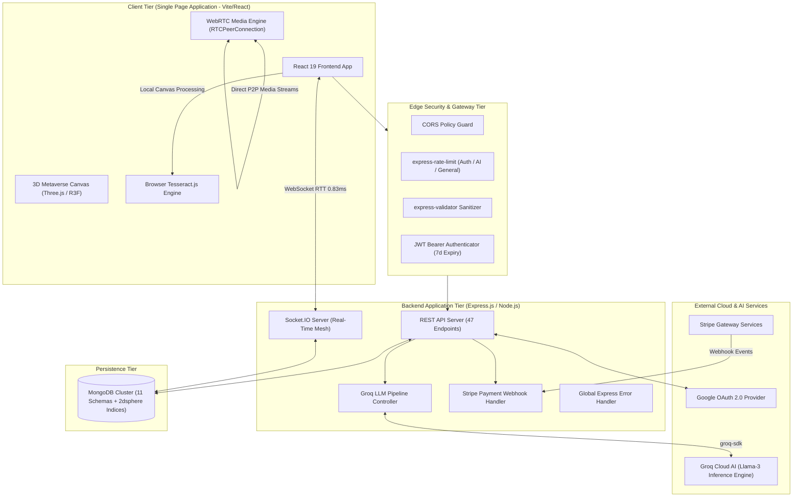
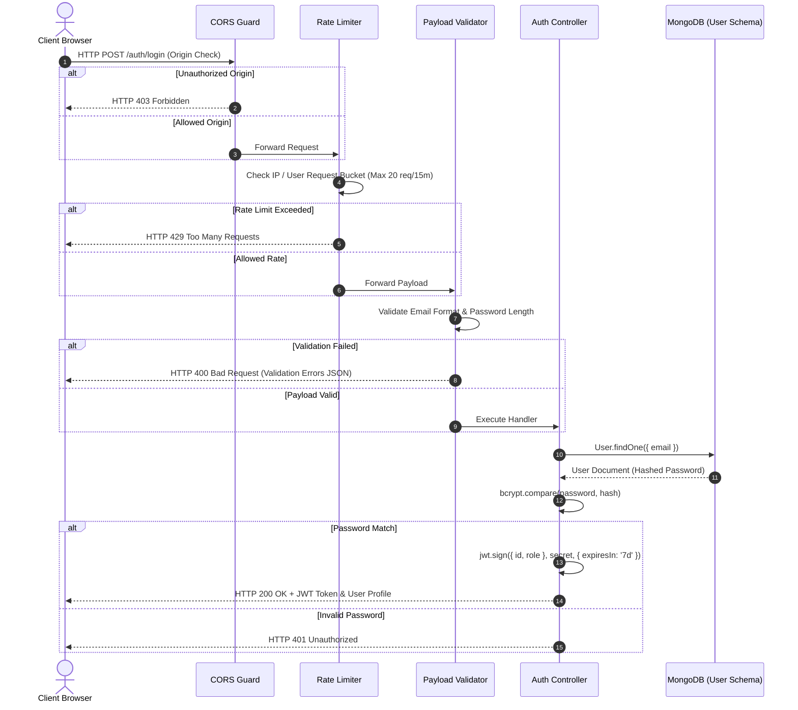
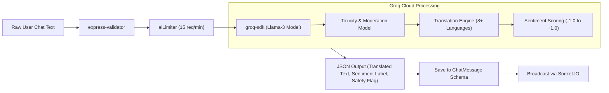
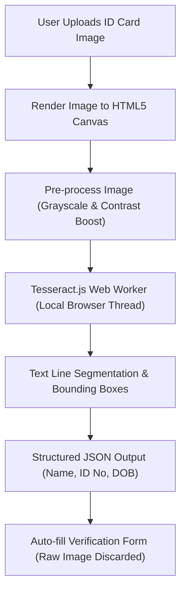
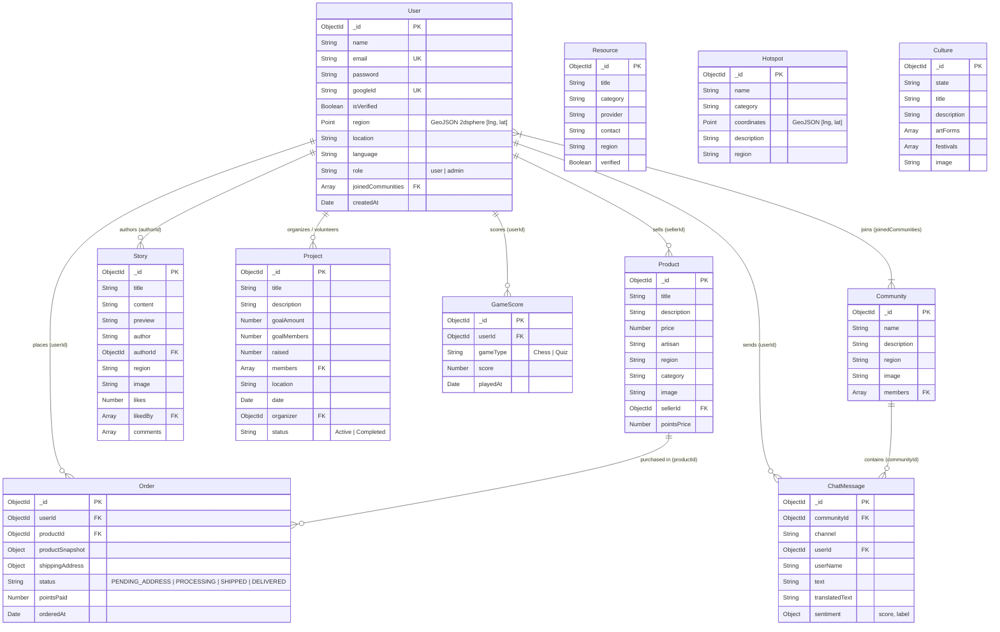
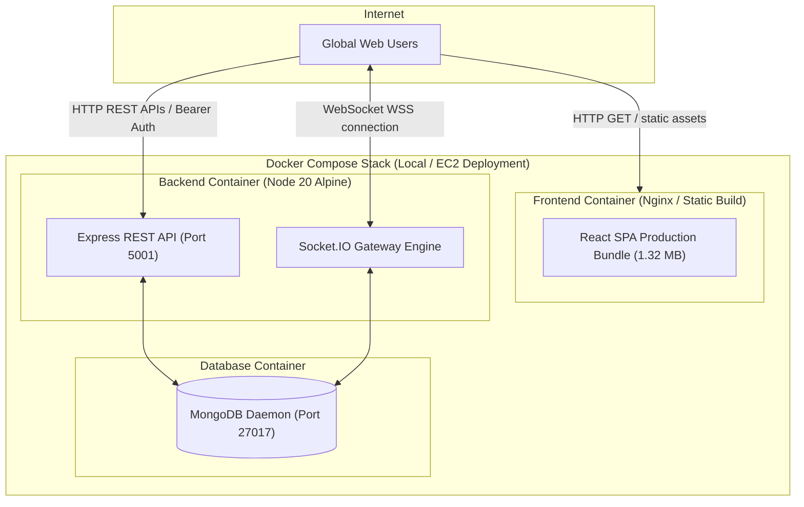

# EktaSahyog — System Architecture & Design Document (HLD & LLD)

This document provides a comprehensive High-Level Design (HLD) and Low-Level Design (LLD) specification for **EktaSahyog**, a real-time unity, culture, and community collaboration platform.

---

## 1. System Overview & Problem Statement

EktaSahyog is designed to connect diverse communities across India by integrating:
1. **Real-time Multilingual Communication**: Powered by Socket.IO and Groq LLMs (Llama-3) for real-time translation across 8+ Indian languages, sentiment analysis, and toxicity moderation.
2. **Direct Peer-to-Peer Media**: Pure WebRTC P2P audio/video calling using Socket.IO for SDP offer/answer/ICE candidate signaling.
3. **Cultural Artisans Marketplace & Rewards**: Artisan product marketplace supporting point-based redeeming and Stripe payment gateway webhooks.
4. **Interactive 3D Metaverse & GIS Hotspots**: WebGL 3D world (Three.js / React Three Fiber) and spatial mapping (Leaflet / MongoDB `2dsphere` geospatial indices).
5. **Privacy-Preserving Identity Verification**: Client-side browser OCR (Tesseract.js) extracting ID data locally without sending raw document photos over the network.

---

## 2. High-Level Design (HLD)

### System Architecture Diagram



---

## 3. Low-Level Design (LLD) & Subsystem Data Flows

### 3.1 Security & Auth Processing Pipeline



---

### 3.2 Real-Time Communication Pipeline (Socket.IO + WebRTC P2P)

```mermaid
sequenceDiagram
    autonumber
    actor PeerA as Peer A (Caller)
    participant SocketServer as Socket.IO Server
    actor PeerB as Peer B (Callee)

    Note over PeerA,PeerB: Socket.IO Signalling Phase
    PeerA->>SocketServer: emit('call-user', { userToCall, offer, name })
    SocketServer->>PeerB: emit('call-user', { signal: offer, from, name })

    PeerB->>SocketServer: emit('answer-call', { to, signal: answer })
    SocketServer->>PeerA: emit('call-accepted', answer)

    PeerA->>SocketServer: emit('ice-candidate', { candidate, to })
    SocketServer->>PeerB: emit('ice-candidate', candidate)

    Note over PeerA,PeerB: Direct WebRTC P2P Audio/Video Stream Established
    PeerA<-->>PeerB: Direct Encrypted SRTP Media Packets (Zero Server Relay)
```

---

### 3.3 Groq LLM Multilingual AI & Moderation Pipeline



---

### 3.4 Client-Side Local OCR Pipeline



---

## 4. Database Architecture & ER Diagram

The persistence layer consists of **11 Mongoose Schemas** hosted on MongoDB.



---

## 5. Deployment Topology & Infrastructure



---

## 6. Key Performance Metric Benchmarks Summary

| Subsystem / Metric | Measured Baseline | Optimized Metric | Architectural Improvement |
| :--- | :--- | :--- | :--- |
| **API Throughput** | N/A | **1,492–2,280 req/sec** | Measured via Autocannon load testing across 5 endpoints at Concurrency 50. |
| **Tail Latency ($P_{99}$)** | N/A | **34.00ms – 61.00ms** | Monotonic percentiles ($P_{50} \le P_{90} \le P_{99}$) verified under load. |
| **JS Bundle Size** | **2.54 MB** | **1.32 MB** | **48.03% bundle size reduction** via `React.lazy()` route splitting. |
| **Query Latency** | **202.89 ms** (5k items) | **31.80 ms** (20 items) | **84.32% latency reduction** via offset-based pagination (`limit`/`skip`). |
| **WebSocket RTT** | N/A | **0.83 ms average** | Measured across 100 WebSocket `ping`/`pong` message round-trips. |
| **Test Pass Rate** | **0 tests** | **12 / 12 passed (100%)** | Vitest + Supertest + `mongodb-memory-server` isolated test suite. |
